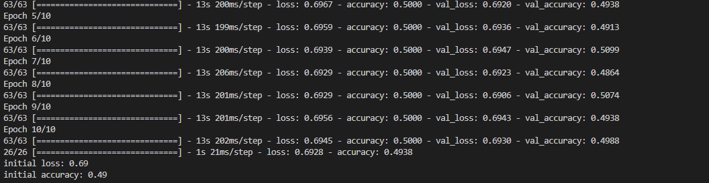

# Tensorflow MobileNet

이미지 인식 알고리즘, 역사도 깊고 인공지능 중 가장 다루기 쉽다고 알려져 있어요. 그야말로 세기의 천재들이 달라붙어 이미 구닥다리가 된 기술들이 적잖이 맍죠. 그래서 공부하기도 쉽다는게 장점이에요. 

모바일넷은 그중에서도 유명한 모델에 속하고 성능도 월등해요. 그만큼 지원을 잘한다는 뜻이겠죠.

근데 텐서플로우를 새로 설치하는데 어려움이 있어요. 그게 뭔지 알아요? 내 맥북은 M1이에요. 맙소사. 지원이 쉽지 않기로 유명하죠.

그래도 괜찮아요. 천재들이 길을 다 만들어 두었으니. 난 그저 그 길을 따라가기만 하면 됩답니다.

천재들의 증거 : https://developer.apple.com/metal/tensorflow-plugin/

# 근데 작동이 안...

그 맥북 이자슥들이 뭔 지원을 개떡같이 해주네요. 결국 데스크탑에서 하기로 결정했답니다. 그것도 무려 4년전 고물덩어리, 아직도 작동하는게 신기할 정도. 업그레이드를 거쳐 3TB의 저장공간을 가진 그 유명한 컴퓨터. 다시 켜봤습니다. 텐서플로우 버전은 2.1 어떤 conda환경은 1도 설치되어 있었어도. 세월 참 빠르네요. 

conda환경을 싹 정리하고 새롭게 설정했어요. 잘 되네요. 마음에 들어요. 이래서 딥러닝을 맥북에서 하는게 아니에요.

와.. 너무 빨라요. 그래픽카드가 구닥다리 1060인데 잘돌아가네요. 진작 데스크탑에서 할걸.

# 그래서 뭐하는 프로젝트냐고요

이미지 인식이라고요. 가장 간단한, 그것도 Be simple. Be direct. 하게. 